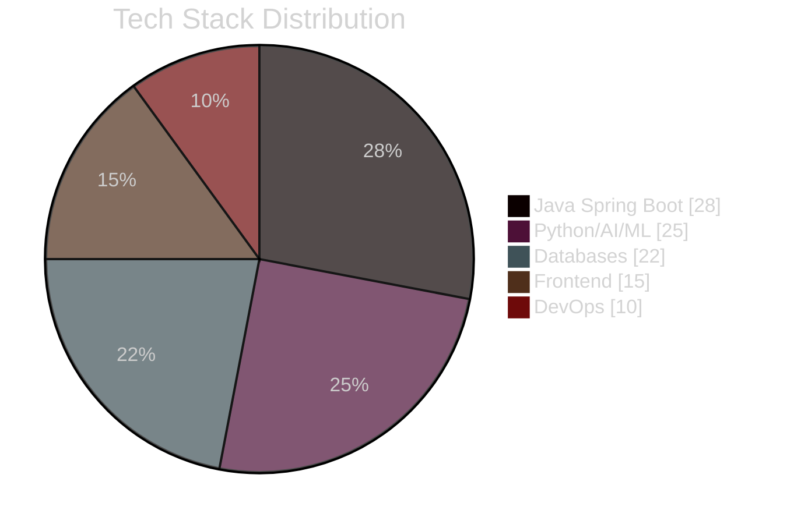

<div align="center">
  
</div>

<p align="center">
  
  
  
  
</p>

```yaml
# 👨‍💻 DEVELOPER PROFILE
name: Aditya Gupta
age: 16
location: Pakur, Jharkhand, India
education: 
  - "🎓 Rajkiya Krit +2 High School (2025)"
  - "🏆 AISSEE All India Rank Holder"
specialties:
  - "☕ Java Spring Boot Expert"
  - "🧠 AI/ML Implementation"
  - "💾 Database Architecture"
  - "🏥 Healthcare Tech"
current_focus: "Building production-ready systems at scale"
```

---

## 📊 GitHub Analytics Dashboard

<div align="center">

| Metric | Visualization |
|--------|--------------|
| **Activity Stats** |  |
| **Language Breakdown** |  |
| **Commit Streak** |  |
| **Activity Graph** |  |

</div>

---

## 🛠️ Technology Stack



| Category       | Technologies                                                                 | Proficiency |
|----------------|------------------------------------------------------------------------------|-------------|
| **Backend**    | Java Spring Boot, Python (Django/FastAPI), Node.js                           | ⭐⭐⭐⭐⭐     |
| **Frontend**   | React, Next.js, TypeScript, Tailwind CSS                                     | ⭐⭐⭐⭐      |
| **Databases**  | Firebase, PostgreSQL, MongoDB, Redis                                         | ⭐⭐⭐⭐⭐     |
| **AI/ML**      | TensorFlow, PyTorch, Computer Vision, NLP                                    | ⭐⭐⭐⭐      |
| **DevOps**     | Docker, Kubernetes, CI/CD Pipelines                                          | ⭐⭐⭐       |
| **Mobile**     | React Native, Flutter                                                        | ⭐⭐⭐       |

---

## 🏆 Featured Projects

<div align="center">

| Project | Description | Tech Stack |
|---------|-------------|------------|
| **[🏥 AIIMS Medical Simulator](https://github.com/adityagupta0251/healthcare-simulation)** | AI-assisted training for nursing students | Spring Boot, React, Firebase |
| **[🎮 Adaptive Warzone](https://github.com/adityagupta0251/ai-game-engine)** | ML-powered multiplayer strategy game | Python, TensorFlow, WebSockets |
| **[🛒 E-Commerce Platform](https://github.com/adityagupta0251/ecommerce-platform)** | Production-ready marketplace | Next.js, Spring Boot, PostgreSQL |

</div>

```python
# PROJECT HIGHLIGHTS
class FeaturedProjects:
    
    def __init__(self):
        self.healthcare_sim = {
            "impact": "🏥 Enhanced medical training for 500+ students",
            "innovation": "🧠 AI-generated patient scenarios",
            "scale": "⚡ Real-time Firebase synchronization"
        }
        
        self.adaptive_warzone = {
            "ai_features": "🤖 Reinforcement learning opponents",
            "networking": "🌐 P2P WebSocket connections",
            "performance": "🎮 60FPS battle simulations"
        }
        
    def show_achievements(self):
        return f"""
        🌟 Notable Achievements:
        • Youngest contributor to AIIMS project at age 16
        • Complex AI implementations in production games
        • Enterprise-grade system architecture experience
        """

print(FeaturedProjects().show_achievements())
```

---

## 📜 Education & Achievements

| Institution | Achievement | Year |
|-------------|-------------|------|
| Rajkiya Krit +2 High School | Secondary Education (Ongoing) | 2025 |
| AISSEE | All India Rank Holder (District 6th) | 2024 |
| Saraswati Shishu Mandir | 3x Consecutive First Rank | 2015-2018 |

```diff
+ Current Academic Focus:
- STEM subjects with programming emphasis
- Competitive exam preparation
- Open source contributions
```

---

## 🤝 Let's Connect

<div align="center">
  
[](https://linkedin.com/in/aditya-gupta-42a275359)
[](mailto:adiunknown0261@gmail.com)
[](https://github.com/adityagupta0251)
[](https://twitter.com/adityagupta0251)

</div>

---

<div align="center">
  


</div>
