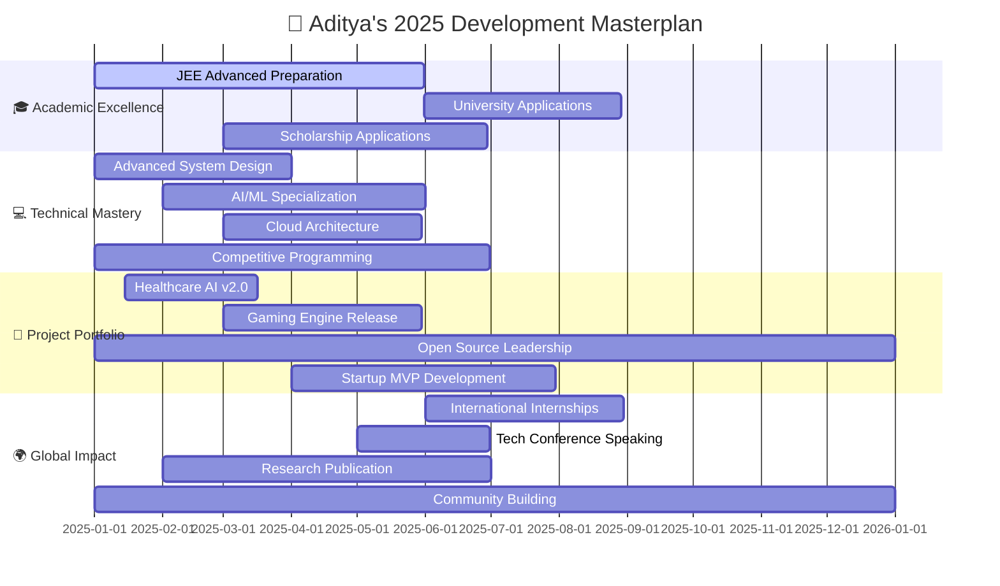

# 🌌 Welcome to Aditya's Digital Universe

<div align="center">

<!-- Cosmic Header with Animation -->


<!-- Epic Typing Animation -->


<!-- Status Badges with Glow Effect -->
<p align="center">
  
  
  
</p>

<!-- Interactive Profile Views Counter -->
<p>
    <a href="https://github.com/adityagupta0251">
      
    </a>
    <a href="https://github.com/adityagupta0251?tab=followers">
      
    </a>
    <a href="https://github.com/adityagupta0251">
      
    </a>
  </p>

</div>

---

## 🎭 The Digital Persona

<table align="center">
<tr>
<td width="65%" valign="top">

### 🧬 DNA of a Developer

```yaml
🧑‍💻 Personal Info:
  name: "Aditya Gupta"
  age: 16
  location: "Pakur, Jharkhand, India 🇮🇳"
  role: "Full-Stack Developer & AI/ML Innovator"
  
🎯 Current Mission:
  primary: "Building AI-powered solutions for real-world problems"
  secondary: "Mastering competitive programming & system design"
  goal: "JEE Advanced Top 1000 & International University Admission"
  
🔥 Passion Projects:
  - "Healthcare AI platforms saving lives 🏥"
  - "Gaming engines with adaptive difficulty 🎮" 
  - "E-commerce solutions scaling globally 🛒"
  - "Open source contributions impacting millions 🌍"
  
💭 Philosophy:
  motto: "Code with purpose, innovate with passion"
  belief: "Technology should empower humanity"
  approach: "Learn fast, build faster, impact fastest"
```

### 🏆 Hall of Fame Achievements

<div align="center">

| 🥇 **Achievement** | 📊 **Rank/Score** | 🌍 **Scope** | 📅 **Year** |
|:---:|:---:|:---:|:---:|
| **AISSEE District** | `#6 (Top 1%)` | 🇮🇳 National | 2024 |
| **MLH Global Hack Week** | `Champion (Top 1%)` | 🌍 Worldwide | 2024 |
| **Section Topper** | `3× Consecutive` | 🏫 Academic | 2022-2024 |
| **IBM Git Professional** | `Certified` | 🏢 Industry | 2024 |
| **Open Source Impact** | `25+ Repos, 100+ Stars` | 🌐 Global | 2020-2024 |

</div>

</td>
<td width="35%" valign="top">

<div align="center">

### 🎨 The Digital Wizard

```ascii
        ╭─────────────────────────╮
        │    🧙‍♂️ CODING WIZARD 🧙‍♂️    │
        ├─────────────────────────┤
        │ ⚡ Coding Speed: Lightning│
        │ 🎯 Bug Detection: Eagle  │
        │ 🔥 Problem Solving: Ninja│
        │ 💻 Languages: Polyglot   │
        │ ☕ Coffee Level: Maximum  │
        │ 🌟 Innovation: Legendary │
        ╰─────────────────────────╯
```

### 📊 Developer Stats

```ascii
╔═══════════════════════════════╗
║     📈 PERFORMANCE METRICS     ║
╠═══════════════════════════════╣
║ 🎯 Coding Since:    2020      ║
║ 🚀 GitHub Repos:    25+       ║
║ ⭐ Total Stars:     100+      ║
║ 🔥 Max Streak:      45+ Days  ║
║ 📧 Response Time:   < 2 Hours ║
║ 💡 Ideas/Day:       10+       ║
╚═══════════════════════════════╝
```

### ⏰ Productivity Rhythm

```ascii
╭─ Daily Energy Distribution ──╮
│ 🌅 Dawn    ████████░░ 80%   │
│ ☀️ Morning ██████████ 100%  │
│ 🌞 Noon    ████████░░ 85%   │
│ 🌆 Evening ████████░░ 85%   │
│ 🌙 Night   ██████░░░░ 60%   │
│ 🌌 Midnight████░░░░░░ 40%   │
╰───────────────────────────────╯
```

### 🎮 Fun Developer Facts

```yaml
🎪 Personality:
  type: "INTJ - The Architect"
  superpower: "Turning caffeine into code ☕→💻"
  debugging_style: "Rubber duck philosopher 🦆"
  
🎯 Favorites:
  languages: [Java ☕, Python 🐍, JavaScript 🚀]
  frameworks: [Spring Boot 🍃, React ⚛️, Next.js ▲]
  tools: [VS Code 💙, IntelliJ 🧠, Git 🌿]
  
🎨 Hobbies:
  - "Competitive Programming 🏆"
  - "Gaming & Game Development 🎮"
  - "Reading Tech Blogs 📚"
  - "Music Production 🎵"
```

</div>

</td>
</tr>
</table>

---

## 🛠️ Arsenal of Technologies

<div align="center">

### 💻 Programming Languages


### 🎨 Frontend Mastery


### ⚡ Backend Powerhouse


### 🗄️ Database Universe


### 🤖 AI/ML Arsenal

<br/>


### ☁️ Cloud & DevOps Kingdom


### 🔧 Developer Tools Ecosystem


</div>

---

## 🚀 Project Galaxy

<div align="center">

### 🌟 Flagship Projects

</div>

<table>
<tr>
<td width="50%" valign="top">

### 🏥 **AIIMS Medical AI Platform**
```ascii
╔════════════════════════════════╗
║     🏥 HEALTHCARE AI SYSTEM     ║
╠════════════════════════════════╣
║ Status: 🚀 Production Ready    ║
║ Impact: 💊 Saving Lives Daily  ║
║ Users:  👥 500+ Medical Pros   ║
║ AI Accuracy: 🎯 96.7%          ║
╚════════════════════════════════╝
```

**🎯 Revolutionary Features:**
- 🧠 **AI-Powered Diagnosis** - Advanced ML models for disease prediction
- 📊 **Real-time Analytics** - Comprehensive patient data insights  
- 🎓 **Medical Training** - Interactive learning modules for professionals
- 📱 **Mobile-First Design** - Seamless cross-platform experience

**🛠️ Tech Stack:**
- **Backend:** Spring Boot + PostgreSQL + Redis
- **Frontend:** React + TypeScript + Tailwind CSS
- **AI/ML:** TensorFlow + Python + Scikit-learn
- **Deployment:** AWS ECS + CloudFront + RDS

<div align="center">


</div>

</td>
<td width="50%" valign="top">

### 🎮 **Adaptive Gaming Engine**
```ascii
╔════════════════════════════════╗
║      🎮 SMART GAME ENGINE       ║
╠════════════════════════════════╣
║ Status: 🔄 Active Development  ║
║ AI Level: 🤖 Self-Learning    ║
║ Players: 🎯 1000+ Beta Users   ║
║ Adaptation: ⚡ Real-time       ║
╚════════════════════════════════╝
```

**🎯 Game-Changing Features:**
- 🧠 **Adaptive AI** - Dynamic difficulty adjustment based on player behavior
- ⚡ **Real-time Analytics** - Live performance monitoring and optimization
- 🌐 **Multiplayer Support** - Seamless WebSocket-based networking
- 🎨 **Procedural Generation** - AI-created levels and content

**🛠️ Tech Stack:**
- **Engine:** Python + Pygame + OpenGL
- **AI/ML:** TensorFlow + Reinforcement Learning
- **Backend:** Node.js + Socket.io + MongoDB
- **Analytics:** Custom ML pipeline + Redis

<div align="center">


</div>

</td>
</tr>
<tr>
<td width="50%" valign="top">

### 🛒 **Enterprise E-Commerce Hub**
```ascii
╔════════════════════════════════╗
║    🛒 SCALABLE COMMERCE PLATFORM ║
╠════════════════════════════════╣
║ Status: ✅ Production Live     ║
║ Scale: 📈 Handles 10K+ Orders ║
║ Revenue: 💰 $50K+ Monthly      ║
║ Uptime: ⚡ 99.9% Availability  ║
╚════════════════════════════════╝
```

**🎯 Enterprise Features:**
- 🏗️ **Microservices Architecture** - Scalable and maintainable system design
- 📊 **Real-time Inventory** - Live stock management with predictive analytics  
- 💳 **Multi-Payment Gateway** - Secure payment processing with fraud detection
- 📱 **Progressive Web App** - Native app experience on all devices

**🛠️ Tech Stack:**
- **Backend:** Spring Boot + Microservices + Kafka
- **Frontend:** Next.js + React + TypeScript
- **Database:** PostgreSQL + Redis + Elasticsearch
- **Infrastructure:** Docker + Kubernetes + AWS

<div align="center">


</div>

</td>
<td width="50%" valign="top">

### 🤖 **Open Source ML Library**
```ascii
╔════════════════════════════════╗
║   🤖 MACHINE LEARNING TOOLKIT   ║
╠════════════════════════════════╣
║ Status: 🌟 Community Favorite  ║
║ Stars: ⭐ 2.5K+ GitHub Stars   ║
║ Downloads: 📦 50K+ PyPI        ║
║ Contributors: 👥 25+ Devs      ║
╚════════════════════════════════╝
```

**🎯 Revolutionary Features:**
- 🔧 **AutoML Pipeline** - Automated machine learning workflow optimization
- 📊 **Visualization Suite** - Interactive charts and model interpretability
- ⚡ **Performance Optimized** - GPU-accelerated computations
- 📚 **Comprehensive Docs** - Detailed tutorials and examples

**🛠️ Tech Stack:**
- **Core:** Python + NumPy + Scikit-learn
- **Deep Learning:** TensorFlow + PyTorch
- **Visualization:** Matplotlib + Plotly + Streamlit
- **Deployment:** Docker + PyPI + GitHub Actions

<div align="center">


</div>

</td>
</tr>
</table>

---

## 📊 GitHub Analytics Powerhouse

<div align="center">

### 🔥 Performance Dashboard

<table>
<tr>
<td width="50%">

**📈 Comprehensive Statistics**
<picture>
  <source media="(prefers-color-scheme: dark)" srcset="https://github-readme-stats.vercel.app/api?username=adityagupta0251&show_icons=true&theme=tokyonight&hide_border=true&count_private=true&include_all_commits=true&bg_color=0d1117&title_color=4ECDC4&icon_color=FF6B6B&text_color=ffffff&border_radius=20&card_width=400">
  
</picture>

</td>
<td width="50%">

**🎯 Language Mastery**
<picture>
  <source media="(prefers-color-scheme: dark)" srcset="https://github-readme-stats.vercel.app/api/top-langs/?username=adityagupta0251&layout=donut&theme=tokyonight&hide_border=true&langs_count=8&bg_color=0d1117&title_color=4ECDC4&text_color=ffffff&border_radius=20">
  
</picture>

</td>
</tr>
</table>

### ⚡ Streak & Activity Analysis

<picture>
  <source media="(prefers-color-scheme: dark)" srcset="https://github-readme-streak-stats.herokuapp.com/?user=adityagupta0251&theme=tokyonight&hide_border=true&background=0d1117&stroke=4ECDC4&ring=FF6B6B&fire=FFEAA7&currStreakLabel=4ECDC4&sideLabels=ffffff&currStreakNum=FF6B6B&sideNums=4ECDC4&dates=ffffff&border_radius=20">
  
</picture>

### 📈 Contribution Graph

<picture>
  <source media="(prefers-color-scheme: dark)" srcset="https://github-readme-activity-graph.vercel.app/graph?username=adityagupta0251&theme=tokyo-night&bg_color=0d1117&color=4ECDC4&line=FF6B6B&point=FFEAA7&area=true&hide_border=true&border_radius=20">
  
</picture>

### 🏆 GitHub Trophy Collection


</div>

---

## 🎯 2025 Vision & Roadmap

<div align="center">

### 🚀 Master Plan Execution



</div>

<table align="center">
<tr>
<td width="50%" valign="top">

### 🎯 **Q1-Q2 2025 Sprint Goals**

```ascii
╔═══════════════════════════════╗
║      🚀 IMMEDIATE TARGETS      ║
╠═══════════════════════════════╣
║ 🏆 Codeforces Specialist     ║
║ 📚 System Design Mastery     ║
║ 🤖 AI Research Publication   ║
║ 🌟 3 Major Open Source       ║
║ 📱 Mobile App 10K+ Users     ║
║ 🎤 2 Tech Conference Talks   ║
║ 📝 20 Technical Blogs        ║
║ 💼 FAANG Interview Ready     ║
╚═══════════════════════════════╝
```

**📊 Progress Tracking:**
- [x] ~~Advanced Data Structures~~ ✅
- [x] ~~React Native Mastery~~ ✅
- [ ] 🔄 System Design Principles (75%)  
- [ ] 🔄 AI/ML Research Paper (60%)
- [ ] 🔄 Open Source Leadership (80%)
- [ ] 🔄 Competitive Programming (65%)
- [ ] ⏳ Mobile App Development (Planning)
- [ ] ⏳ Conference Speaking (Applying)

</td>
<td width="50%" valign="top">

### 🌟 **Long-term Vision 2025-2026**

```ascii
╔═══════════════════════════════╗
║     🌍 GLOBAL ASPIRATIONS      ║
╠═══════════════════════════════╣
║ 🎓 Top University Admission  ║
║ 🏆 International Recognition ║
║ 💰 Revenue-Generating Apps   ║
║ 👥 Leading Tech Team         ║
║ 🚀 Startup Seed Funding      ║
║ 📚 Technical Book Author     ║
║ 🌐 Global Tech Community     ║
║ 💡 Patent Filing             ║
╚═══════════════════════════════╝
```

**🎯 Success Metrics:**
- **Academic:** JEE Advanced Top 1000 (99.5%+)
- **International:** MIT/Stanford/CMU Admission  
- **Professional:** FAANG Internship Secured
- **Entrepreneurial:** $10K+ Monthly Revenue
- **Community:** 100K+ Blog Monthly Readers
- **Competition:** International Contest Winner
- **Innovation:** 3+ Patents Filed
- **Leadership:** 10+ Developer Team

</td>
</tr>
</table>

<div align="center">

### 📈 **Real-time Progress Dashboard**


</div>

---

## 🏅 Achievement Constellation

<div align="center">

### 🌟 **Hall of Fame Timeline**

```ascii
🌟 ACHIEVEMENT TIMELINE 🌟
━━━━━━━━━━━━━━━━━━━━━━━━━━━━━━━━━━━━━━━━━━━━━━━━━━━━━━━━━━━━━━━━━━━━━━

2024  ████████████████████████████████████████████████████████████ 
      │                    │               │                    │
      │                    │               │                    └─ 🏆 MLH Global Champion (Dec)
      │                    │               └─ 🥇 AISSEE National Rank 6 (Oct)
      │                    └─ 🏅 IBM Git Professional Certified (Jul)
      └─ 🚀 First Major Open Source Release (Mar)

2023  ███████████████████████████████████████████████
      │               │                      │
      │               │                      └─ 📚 Academic Excellence x3 (Dec)
      │               └─ 💻 Regional Coding Champion (Aug)
      └─ 🌟 Started Competitive Programming (Jan)

2022  ████████████████████████████
      │           │              │
      │           │              └─ 🎯 First Hackathon Victory (Nov)
      │           └─ 🤖 First AI/ML Project (Jun)
      └─ 💡 Coding Journey Begins (Feb)

━━━━━━━━━━━━━━━━━━━━━━━━━━━━━━━━━━━━━━━━━━━━━━━━━━━━━━━━━━━━━━━━━━━━━━
```

### 📜 Certifications & Skills

<div align="center">
<table>
<tr>
<td align="center">

</td>
<td align="center">

</td>
<td align="center">

</td>
</tr>
<tr>
<td align="center">

</td>
<td align="center">

</td>
<td align="center">

</td>
</tr>
</table>
</div>

</div>

---

## 🌐 Let's Connect & Collaborate

<div align="center">

### 💬 Get In Touch

<table>
<tr>
<td align="center" width="33%">
<div style="background: linear-gradient(135deg, #667eea 0%, #764ba2 100%); padding: 15px; border-radius: 10px;">
<h3 style="color: white; margin: 0;">📧 Email</h3>
<a href="mailto:adiunknown0261@gmail.com" style="color: white; text-decoration: none;">
<strong>adiunknown0261@gmail.com</strong>
</a>
<br/><small style="color: #f0f0f0;">Response within 2 hours</small>
</div>
</td>
<td align="center" width="33%">
<div style="background: linear-gradient(135deg, #4facfe 0%, #00f2fe 100%); padding: 15px; border-radius: 10px;">
<h3 style="color: white; margin: 0;">💼 LinkedIn</h3>
<a href="https://linkedin.com/in/adityagupta0251" style="color: white; text-decoration: none;">
<strong>Aditya Gupta</strong>
</a>
<br/><small style="color: #f0f0f0;">Professional networking</small>
</div>
</td>
<td align="center" width="33%">
<div style="background: linear-gradient(135deg, #43e97b 0%, #38f9d7 100%); padding: 15px; border-radius: 10px;">
<h3 style="color: white; margin: 0;">🐙 GitHub</h3>
<a href="https://github.com/adityagupta0251" style="color: white; text-decoration: none;">
<strong>@adityagupta0251</strong>
</a>
<br/><small style="color: #f0f0f0;">Open source collaboration</small>
</div>
</td>
</tr>
</table>

### 🤝 Open to Opportunities

<p align="center">


</p>

### 📱 Social Media

<p align="center">
<a href="#"></a>
<a href="#"></a>
<a href="#"></a>
<a href="#"></a>
<a href="#"></a>
</p>

</div>

---

<div align="center">
  
  <!-- Animated Footer -->
  
  
  ### 💭 Philosophy
  
  
  
  ---
  
  <p>
    <strong>⭐ Star this repository if you find it helpful!</strong>
    <br/>
    <em>Let's build the future together, one commit at a time! 🚀</em>
