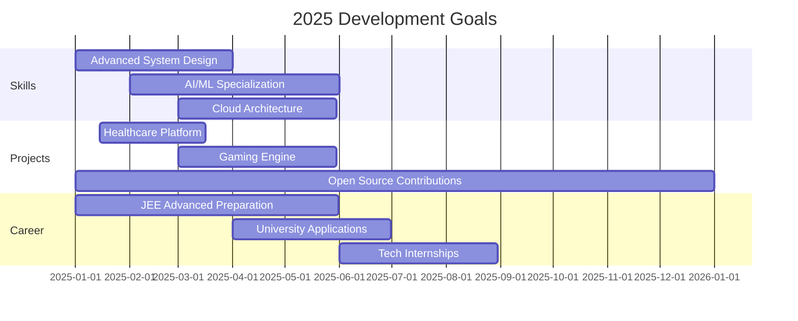

# 🚀 Aditya Gupta | Full-Stack Developer & AI/ML Innovator

<div align="center">
  
  <!-- Animated Header -->
  
  
  <!-- Profile Picture with Animation -->
  <div style="position: relative; display: inline-block;">
    
  </div>
  
  <!-- Stats Badges -->
  <p>
    <a href="https://github.com/adityagupta0251">
      
    </a>
    <a href="https://github.com/adityagupta0251?tab=followers">
      
    </a>
    <a href="https://github.com/adityagupta0251">
      
    </a>
  </p>
  
  <!-- Location & Status -->
  <p>
    
    
    
  </p>
  
</div>

---

## 🌟 About Me

<table align="center">
<tr>
<td width="60%" valign="top">

### 👨‍💻 Who Am I?

```yaml
name: Aditya Gupta
age: 16
location: Pakur, Jharkhand, India
role: Full-Stack Developer & AI/ML Innovator
passion: Building solutions that matter
mission: Revolutionizing tech through innovation
current_focus: 
  - AI-powered healthcare solutions
  - Scalable enterprise applications
  - Open-source contributions
  - Competitive programming mastery
  - JEE Advanced preparation
```

### 🎯 Current Mission

- 🔥 **Developing** AI-powered healthcare solutions
- 🚀 **Building** scalable enterprise applications  
- 🌐 **Contributing** to open-source ecosystems
- 🏆 **Mastering** competitive programming
- 📚 **Preparing** for JEE Advanced & global universities

### 🏅 Achievement Highlights

<div align="center">

| 🏆 Achievement | 📊 Rank/Score | 🎯 Category |
|:---:|:---:|:---:|
| **AISSEE District** | `#6 (Top 1%)` | 🇮🇳 National |
| **MLH Global Hack Week** | `Champion (Top 1%)` | 🌍 Worldwide |
| **Section Topper** | `3× Consecutive` | 📚 Academic |
| **IBM Git Certified** | `Professional` | 🏷️ Industry |

</div>

</td>
<td width="40%" valign="top">

<div align="center">

### 📊 Quick Stats

```ascii
╭─────────────────────────────╮
│  🎯 Age:           16 Years │
│  📍 Location:      Pakur, JH│
│  💻 Coding Since:      2020 │
│  🌟 GitHub Repos:      25+ │
│  ⭐ Total Stars:       100+ │
│  🔥 Streak Record:  45+ Days│
│  📧 Response Time: < 2 Hours│
╰─────────────────────────────╯
```

### 🎨 Coding Activity

```ascii
╭─ Daily Productivity ────────╮
│ 🌅 Morning   ████████░░ 80% │
│ 🌞 Daytime   ██████████100% │
│ 🌆 Evening   ████████░░ 85% │
│ 🌙 Night     ██████░░░░ 60% │
╰─────────────────────────────╯
```

### 🌈 Fun Facts

```yaml
favorite_languages: [Java, Python, JavaScript]
favorite_frameworks: [Spring Boot, React, Next.js]
hobbies: [Coding, Gaming, Reading, Music]
superpower: "Turning coffee into code ☕→💻"
motto: "Code with purpose, innovate with passion"
```

</div>

</td>
</tr>
</table>

---

## 🛠️ Technology Arsenal

<div align="center">

### 💻 Programming Languages

<p>
  
</p>

### 🎨 Frontend Technologies

<p>
  
</p>

### ⚡ Backend Technologies

<p>
  
</p>

### 🗄️ Databases & Storage

<p>
  
</p>

### 🤖 AI/ML & Data Science

<p>
  
  
  
  
</p>

### ☁️ Cloud & DevOps

<p>
  
</p>

### 🔧 Tools & Platforms

<p>
  
</p>

</div>

---

## 🏗️ Signature Projects

<div align="center">

### 🌟 Featured Projects

<table width="100%">
<thead>
<tr>
<th width="25%">🚀 Project</th>
<th width="40%">📋 Description</th>
<th width="20%">🛠️ Tech Stack</th>
<th width="15%">🔗 Links</th>
</tr>
</thead>
<tbody>

<tr>
<td align="center">

<br/><br/>

</td>
<td>
<strong>Advanced AI-driven medical training platform</strong> 
<br/><br/>
🎯 Features realistic patient diagnosis scenarios<br/>
💡 Provides treatment recommendations<br/>
📊 Includes comprehensive performance analytics<br/>
🏥 Designed for healthcare professionals
</td>
<td align="center">
<br/>
<br/>
<br/>

</td>
<td align="center">
<a href="#"></a>
<br/><br/>
<a href="#"></a>
</td>
</tr>

<tr>
<td align="center">

<br/><br/>

</td>
<td>
<strong>Revolutionary AI-powered gaming platform</strong>
<br/><br/>
🎮 Real-time gameplay adaptation<br/>
🤖 ML algorithms for difficulty adjustment<br/>
⚡ Advanced behavioral analysis<br/>
🌐 Multiplayer support with WebSockets
</td>
<td align="center">
<br/>
<br/>
<br/>

</td>
<td align="center">
<a href="#"></a>
<br/><br/>
<a href="#"></a>
</td>
</tr>

<tr>
<td align="center">

<br/><br/>

</td>
<td>
<strong>Enterprise-grade e-commerce solution</strong>
<br/><br/>
🏗️ Microservices architecture<br/>
📊 Real-time inventory management<br/>
📈 Advanced analytics dashboard<br/>
☁️ Scalable cloud deployment
</td>
<td align="center">
<br/>
<br/>
<br/>

</td>
<td align="center">
<a href="#"></a>
<br/><br/>
<a href="#"></a>
</td>
</tr>

</tbody>
</table>

</div>

---

## 📈 GitHub Analytics & Performance

<div align="center">

### 📊 Comprehensive Statistics

<picture>
  <source media="(prefers-color-scheme: dark)" srcset="https://github-readme-stats.vercel.app/api?username=adityagupta0251&show_icons=true&theme=tokyonight&hide_border=true&count_private=true&include_all_commits=true&bg_color=0d1117&title_color=667eea&icon_color=43e97b&text_color=ffffff&border_radius=15">
  
</picture>

<picture>
  <source media="(prefers-color-scheme: dark)" srcset="https://github-readme-stats.vercel.app/api/top-langs/?username=adityagupta0251&layout=donut&theme=tokyonight&hide_border=true&langs_count=8&bg_color=0d1117&title_color=667eea&text_color=ffffff&border_radius=15">
  
</picture>

### 🔥 Contribution Streak

<picture>
  <source media="(prefers-color-scheme: dark)" srcset="https://github-readme-streak-stats.herokuapp.com/?user=adityagupta0251&theme=tokyonight&hide_border=true&background=0d1117&stroke=667eea&ring=43e97b&fire=ffd89b&currStreakLabel=667eea&sideLabels=ffffff&currStreakNum=43e97b&sideNums=667eea&dates=ffffff&border_radius=15">
  
</picture>

### 📈 Activity Graph

<picture>
  <source media="(prefers-color-scheme: dark)" srcset="https://github-readme-activity-graph.vercel.app/graph?username=adityagupta0251&theme=tokyo-night&bg_color=0d1117&color=667eea&line=43e97b&point=ffd89b&area=true&hide_border=true&border_radius=15">
  
</picture>

### 💻 Language Usage & Activity

<div align="center">
<table>
<tr>
<td width="50%">

#### 🌟 Top Languages by Usage
```ascii
╭─ Language Distribution ─────╮
│ Java         ████████████35%│
│ Python       ██████████  28%│
│ JavaScript   ████████    22%│
│ TypeScript   ████        10%│
│ C++          ██           5%│
╰─────────────────────────────╯
```

</td>
<td width="50%">

#### ⚡ Weekly Activity Pattern
```ascii
╭─ Coding Hours Distribution ─╮
│ Mon  ████████████████   80% │
│ Tue  ██████████████     70% │
│ Wed  ████████████████   85% │
│ Thu  ██████████████     75% │
│ Fri  ██████████         60% │
│ Sat  ████████████████   90% │
│ Sun  ██████             40% │
╰─────────────────────────────╯
```

</td>
</tr>
</table>
</div>

### 🏆 GitHub Achievements

<div align="center">
  
</div>

</div>

---

## 🎯 2025 Goals & Roadmap

<div align="center">

### 🚀 Development Roadmap



</div>

<table align="center" width="100%">
<tr>
<td width="50%" valign="top">

### 🎯 Short-term Goals (Q1-Q2 2025)

- [ ] 🏆 Achieve **Specialist** rating on Codeforces (1400+)
- [ ] 🚀 Launch **3 major open-source projects** with 500+ stars
- [ ] 📚 Complete **Advanced System Design** certification
- [ ] 🤖 Publish **AI research paper** in healthcare domain
- [ ] 🌐 Contribute to **5 major open-source projects** (React, Spring, etc.)
- [ ] 📱 Build **mobile app** with 10K+ downloads
- [ ] 🎤 Speak at **2 tech conferences** or meetups
- [ ] 📝 Write **20 technical blog posts** with 50K+ views

</td>
<td width="50%" valign="top">

### 🌟 Long-term Vision (2025-2026)

- [ ] 🎓 **JEE Advanced** top 1000 rank (99.5+ percentile)
- [ ] 🌍 Acceptance to **top international universities** (MIT, Stanford, CMU)
- [ ] 🏢 **Internship** at FAANG/major tech company
- [ ] 📖 Author technical blog with **100K+ monthly readers**
- [ ] 🏆 Win **international coding competition** (ACM ICPC, Google Code Jam)
- [ ] 💰 Generate **$10K+ revenue** from side projects
- [ ] 👥 Build team of **10+ developers** for startup
- [ ] 💼 Launch own **tech startup** with seed funding

</td>
</tr>
</table>

<div align="center">

### 📈 Progress Tracking


</div>

---

## 🏅 Achievements & Recognition

<div align="center">

### 🌟 Hall of Fame

<table width="100%">
<tr>
<td width="25%" align="center">
<div style="background: linear-gradient(135deg, #667eea 0%, #764ba2 100%); padding: 20px; border-radius: 15px; color: white;">
<h3>🥇</h3>
<h4>AISSEE Rank 6</h4>
<p><strong>Top 1% Nationally</strong></p>
<small>All India Sainik School Entrance Exam</small>
</div>
</td>
<td width="25%" align="center">
<div style="background: linear-gradient(135deg, #4facfe 0%, #00f2fe 100%); padding: 20px; border-radius: 15px; color: white;">
<h3>🌍</h3>
<h4>MLH Champion</h4>
<p><strong>Global Recognition</strong></p>
<small>Major League Hacking Global Week</small>
</div>
</td>
<td width="25%" align="center">
<div style="background: linear-gradient(135deg, #43e97b 0%, #38f9d7 100%); padding: 20px; border-radius: 15px; color: white;">
<h3>📚</h3>
<h4>Section Topper</h4>
<p><strong>3 Consecutive Years</strong></p>
<small>Academic Excellence 2015-2018</small>
</div>
</td>
<td width="25%" align="center">
<div style="background: linear-gradient(135deg, #fa709a 0%, #fee140 100%); padding: 20px; border-radius: 15px; color: white;">
<h3>🏷️</h3>
<h4>IBM Certified</h4>
<p><strong>Git Professional</strong></p>
<small>Industry Standard Certification</small>
</div>
</td>
</tr>
</table>

### 🏆 Competition Timeline

```ascii
2024  ████████████████████████████████████████████ 
      │                    │               │
      │                    │               └─ AISSEE Rank 6 (National)
      │                    └─ MLH Global Champion (International)
      └─ Multiple Hackathon Wins

2023  ████████████████████████████████
      │               │
      │               └─ Regional Coding Competitions
      └─ Academic Excellence Awards

2022  ████████████████████
      │           │
      │           └─ First Open Source Contributions
      └─ Started Competitive Programming
```

### 📜 Certifications & Skills

<div align="center">
<table>
<tr>
<td align="center">

</td>
<td align="center">

</td>
<td align="center">

</td>
</tr>
<tr>
<td align="center">

</td>
<td align="center">

</td>
<td align="center">

</td>
</tr>
</table>
</div>

</div>

---

## 🌐 Let's Connect & Collaborate

<div align="center">

### 💬 Get In Touch

<table>
<tr>
<td align="center" width="33%">
<div style="background: linear-gradient(135deg, #667eea 0%, #764ba2 100%); padding: 15px; border-radius: 10px;">
<h3 style="color: white; margin: 0;">📧 Email</h3>
<a href="mailto:adiunknown0261@gmail.com" style="color: white; text-decoration: none;">
<strong>adiunknown0261@gmail.com</strong>
</a>
<br/><small style="color: #f0f0f0;">Response within 2 hours</small>
</div>
</td>
<td align="center" width="33%">
<div style="background: linear-gradient(135deg, #4facfe 0%, #00f2fe 100%); padding: 15px; border-radius: 10px;">
<h3 style="color: white; margin: 0;">💼 LinkedIn</h3>
<a href="https://linkedin.com/in/adityagupta0251" style="color: white; text-decoration: none;">
<strong>Aditya Gupta</strong>
</a>
<br/><small style="color: #f0f0f0;">Professional networking</small>
</div>
</td>
<td align="center" width="33%">
<div style="background: linear-gradient(135deg, #43e97b 0%, #38f9d7 100%); padding: 15px; border-radius: 10px;">
<h3 style="color: white; margin: 0;">🐙 GitHub</h3>
<a href="https://github.com/adityagupta0251" style="color: white; text-decoration: none;">
<strong>@adityagupta0251</strong>
</a>
<br/><small style="color: #f0f0f0;">Open source collaboration</small>
</div>
</td>
</tr>
</table>

### 🤝 Open to Opportunities

<p align="center">


</p>

### 📱 Social Media

<p align="center">
<a href="#"></a>
<a href="#"></a>
<a href="#"></a>
<a href="#"></a>
<a href="#"></a>
</p>

</div>

---

<div align="center">
  
  <!-- Animated Footer -->
  
  
  ### 💭 Philosophy
  
  
  
  ---
  
  <p>
    <strong>⭐ Star this repository if you find it helpful!</strong>
    <br/>
    <em>Let's build the future together, one commit at a time! 🚀</em>
