# 🚀 Aditya Gupta | Full-Stack Developer & AI/ML Innovator
<br>


<div align="center">

[](https://github.com/adityagupta0251)
[](https://github.com/adityagupta0251?tab=followers)
[](https://github.com/adityagupta0251)


</div>

---

## 🌟 About Me

<table align="center" width="100%">
<tr>
<td width="60%" valign="top">

### 👨‍💻 Who Am I?

I'm a **passionate 16-year-old technologist** from Pakur, Jharkhand, India, on a mission to revolutionize the tech world through innovative solutions. Currently balancing **STEM-focused secondary education** while building scalable applications that solve real-world problems.

### 🎯 Current Mission
- 🔥 Developing **AI-powered healthcare solutions**
- 🚀 Building **scalable enterprise applications**
- 🌐 Contributing to **open-source ecosystems**
- 🏆 Mastering **competitive programming**
- 📚 Preparing for **JEE Advanced** and global universities

### 🏅 Achievement Highlights
- 🥇 **AISSEE District Rank #6** (Top 1% Nationally)
- 🌍 **MLH Global Hack Week Champion** (Top 1% Worldwide)
- 📈 **3× Consecutive Section Topper** (2015-2018)
- 🏷️ **IBM Git Certified Professional**

</td>
<td width="40%" valign="top">

<div align="center">

### 📊 Quick Stats

```text
🎯 Age:                    16 Years
📍 Location:               Pakur, Jharkhand
💻 Coding Since:           2020
🌟 GitHub Repos:           25+
⭐ Total Stars:            100+
🔥 Streak Record:          45+ Days
📧 Response Time:          < 2 Hours
```

### 🎨 Coding Activity

```text
🌅 Morning   ████████░░ 80%
🌞 Daytime   ██████████ 100%
🌆 Evening   ████████░░ 85%
🌙 Night     ██████░░░░ 60%
```

</div>

</td>
</tr>
</table>

---

## 🛠️ Technology Arsenal

<div align="center">

### 💻 Programming Languages
[](https://www.java.com)
[](https://python.org)
[](https://javascript.info)
[](https://typescriptlang.org)
[](https://cplusplus.com)

### 🎨 Frontend Technologies
[](https://react.dev)
[](https://nextjs.org)
[](https://vuejs.org)
[](https://tailwindcss.com)
[](https://developer.mozilla.org/en-US/docs/Web/HTML)

### ⚡ Backend Technologies
[](https://spring.io/projects/spring-boot)
[](https://nodejs.org)
[](https://expressjs.com)
[](https://djangoproject.com)
[](https://fastapi.tiangolo.com)

### 🗄️ Databases & Storage
[](https://postgresql.org)
[](https://mongodb.com)
[](https://redis.io)
[](https://mysql.com)
[](https://firebase.google.com)

### 🤖 AI/ML & Data Science
[](https://tensorflow.org)
[](https://pytorch.org)
[](https://opencv.org)
[](https://pandas.pydata.org)
[](https://scikit-learn.org)

### ☁️ Cloud & DevOps
[](https://aws.amazon.com)
[](https://cloud.google.com)
[](https://docker.com)
[](https://kubernetes.io)
[](https://vercel.com)

### 🔧 Tools & Platforms
[](https://git-scm.com)
[](https://github.com)
[](https://kernel.org)
[](https://code.visualstudio.com)
[](https://jetbrains.com/idea)

</div>

---

## 🏗️ Signature Projects

<table align="center" width="100%">
  <thead>
    <tr style="background: linear-gradient(90deg, #3B82F6, #1D4ED8);">
      <th width="20%" style="color: white; padding: 12px;">🚀 Project</th>
      <th width="35%" style="color: white; padding: 12px;">📋 Description</th>
      <th width="25%" style="color: white; padding: 12px;">🛠️ Tech Stack</th>
      <th width="10%" style="color: white; padding: 12px;">📊 Status</th>
      <th width="10%" style="color: white; padding: 12px;">🔗 Links</th>
    </tr>
  </thead>
  <tbody>
    <tr style="background: rgba(59, 130, 246, 0.05);">
      <td style="padding: 12px;"><strong>🏥 AIIMS Medical AI Simulator</strong></td>
      <td style="padding: 12px;">Advanced AI-driven medical training platform with realistic simulations for healthcare professionals. Features include patient diagnosis scenarios, treatment recommendations, and performance analytics.</td>
      <td style="padding: 12px;">
        <code>Spring Boot</code><br>
        <code>React</code><br>
        <code>TensorFlow</code><br>
        <code>PostgreSQL</code>
      </td>
      <td style="padding: 12px;">
        
      </td>
      <td style="padding: 12px;">
        <a href="#"></a><br>
        <a href="#"></a>
      </td>
    </tr>
    <tr style="background: rgba(34, 197, 94, 0.05);">
      <td style="padding: 12px;"><strong>🎮 Adaptive Warzone Engine</strong></td>
      <td style="padding: 12px;">Revolutionary AI-powered gaming platform that adapts gameplay in real-time based on player behavior. Includes advanced machine learning algorithms for dynamic difficulty adjustment.</td>
      <td style="padding: 12px;">
        <code>Python</code><br>
        <code>TensorFlow</code><br>
        <code>WebSockets</code><br>
        <code>Redis</code>
      </td>
      <td style="padding: 12px;">
        
      </td>
      <td style="padding: 12px;">
        <a href="#"></a><br>
        <a href="#"></a>
      </td>
    </tr>
    <tr style="background: rgba(139, 92, 246, 0.05);">
      <td style="padding: 12px;"><strong>🛒 Enterprise E-Commerce Hub</strong></td>
      <td style="padding: 12px;">Scalable enterprise-grade e-commerce solution with microservices architecture, real-time inventory management, and advanced analytics dashboard.</td>
      <td style="padding: 12px;">
        <code>Next.js</code><br>
        <code>Spring Boot</code><br>
        <code>Docker</code><br>
        <code>AWS</code>
      </td>
      <td style="padding: 12px;">
        
      </td>
      <td style="padding: 12px;">
        <a href="#"></a><br>
        <a href="#"></a>
      </td>
    </tr>
    <tr style="background: rgba(239, 68, 68, 0.05);">
      <td style="padding: 12px;"><strong>🔐 CyberSec Toolkit</strong></td>
      <td style="padding: 12px;">Comprehensive ethical hacking and penetration testing toolkit with automated vulnerability scanning, network analysis, and security reporting features.</td>
      <td style="padding: 12px;">
        <code>Python</code><br>
        <code>Linux</code><br>
        <code>Nmap</code><br>
        <code>Bash</code>
      </td>
      <td style="padding: 12px;">
        
      </td>
      <td style="padding: 12px;">
        <a href="#"></a><br>
        <a href="#"></a>
      </td>
    </tr>
    <tr style="background: rgba(245, 158, 11, 0.05);">
      <td style="padding: 12px;"><strong>🤖 ChatBot Intelligence Hub</strong></td>
      <td style="padding: 12px;">Advanced conversational AI platform with natural language processing capabilities, multi-language support, and enterprise-grade integrations.</td>
      <td style="padding: 12px;">
        <code>Python</code><br>
        <code>FastAPI</code><br>
        <code>Transformers</code><br>
        <code>MongoDB</code>
      </td>
      <td style="padding: 12px;">
        
      </td>
      <td style="padding: 12px;">
        <a href="#"></a><br>
        <a href="#"></a>
      </td>
    </tr>
    <tr style="background: rgba(34, 197, 94, 0.05);">
      <td style="padding: 12px;"><strong>📊 Data Visualization Suite</strong></td>
      <td style="padding: 12px;">Interactive data visualization platform with real-time analytics, custom dashboard creation, and advanced chart generation capabilities.</td>
      <td style="padding: 12px;">
        <code>React</code><br>
        <code>D3.js</code><br>
        <code>Node.js</code><br>
        <code>PostgreSQL</code>
      </td>
      <td style="padding: 12px;">
        
      </td>
      <td style="padding: 12px;">
        <a href="#"></a><br>
        <a href="#"></a>
      </td>
    </tr>
  </tbody>
</table>

---

## 📈 GitHub Analytics & Performance

<div align="center">

### 📊 Comprehensive Statistics


### 🔥 Contribution Streak


### 📈 Contribution Graph


### 💻 Coding Activity Breakdown

<div align="center">
<table width="80%">
<tr>
<td width="50%" valign="top">

#### 🌟 Top Languages
```text
Java          ████████████ 35%
Python        ██████████░░ 28%
JavaScript    ████████░░░░ 22%
TypeScript    ████░░░░░░░░ 10%
C++           ██░░░░░░░░░░  5%
```

</td>
<td width="50%" valign="top">

#### ⚡ Activity Times
```text
🌅 06:00-12:00  ████████░░ 40%
🌞 12:00-18:00  ██████████ 50%
🌆 18:00-00:00  ████████░░ 35%
🌙 00:00-06:00  ██░░░░░░░░ 10%
```

</td>
</tr>
</table>
</div>

### 🏆 GitHub Trophies


</div>

---

## 🎯 2025 Goals & Roadmap

<div align="center">

<table width="100%">
<tr>
<td width="50%" valign="top">

### 🎯 Short-term Goals (Q1-Q2 2025)
- [ ] 🏆 Achieve **Specialist** rating on Codeforces
- [ ] 🚀 Launch **3 major open-source projects**
- [ ] 📚 Complete **Advanced System Design** course
- [ ] 🤖 Publish **AI research paper** in healthcare
- [ ] 🌐 Contribute to **5 major open-source projects**
- [ ] 📱 Build **mobile app** with 10K+ downloads

</td>
<td width="50%" valign="top">

### 🌟 Long-term Vision (2025-2026)
- [ ] 🎓 **JEE Advanced** top 1000 rank
- [ ] 🌍 Acceptance to **top international universities**
- [ ] 🏢 **Internship** at major tech company
- [ ] 📖 Author technical blog with **100K+ readers**
- [ ] 🎤 Speaker at **major tech conferences**
- [ ] 💼 Launch own **tech startup**

</td>
</tr>
</table>

### 📈 Growth Trajectory

```mermaid
graph LR
    A[🚀 Current State] --> B[📚 Skill Enhancement]
    B --> C[🔥 Project Portfolio]
    C --> D[🌐 Open Source]
    D --> E[🏆 Competitions]
    E --> F[🎓 Higher Education]
    F --> G[💼 Career Success]
    
    style A fill:#3B82F6,stroke:#1D4ED8,stroke-width:3px,color:#fff
    style G fill:#22C55E,stroke:#16A34A,stroke-width:3px,color:#fff
```



</div>

---

## 🏅 Achievements & Recognition

<div align="center">

<table width="100%">
<tr>
<td width="25%" align="center">

<br><small><strong>Top 1% Nationally</strong></small>
</td>
<td width="25%" align="center">

<br><small><strong>Global Recognition</strong></small>
</td>
<td width="25%" align="center">

<br><small><strong>3 Consecutive Years</strong></small>
</td>
<td width="25%" align="center">

<br><small><strong>Git Professional</strong></small>
</td>
</tr>
</table>

### 🏆 Competition History

| Year | Competition | Rank | Category |
|------|-------------|------|----------|
| 2024 | MLH Global Hack Week | 🥇 1st | International |
| 2024 | AISSEE National Exam | 🥈 6th | National |
---

## 🤝 Let's Connect

<div align="center">
  
  [](mailto:adiunknown0261@gmail.com)
  [](https://linkedin.com/in/adityagupta0251)
  [](https://github.com/adityagupta0251)
  
</div>

---

<div align="center">
  
  
  **💡 "Code with purpose, innovate with passion"**
  
  <sub>⭐ Star this repository if you find it helpful!</sub>
</div>
